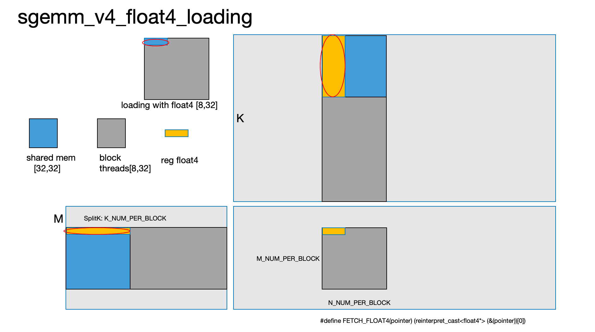
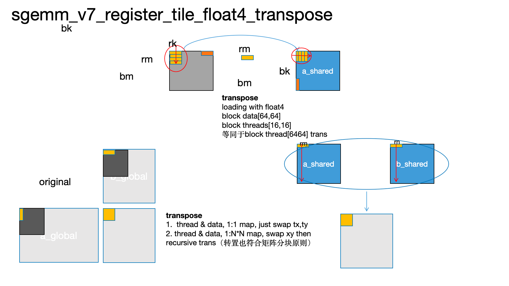
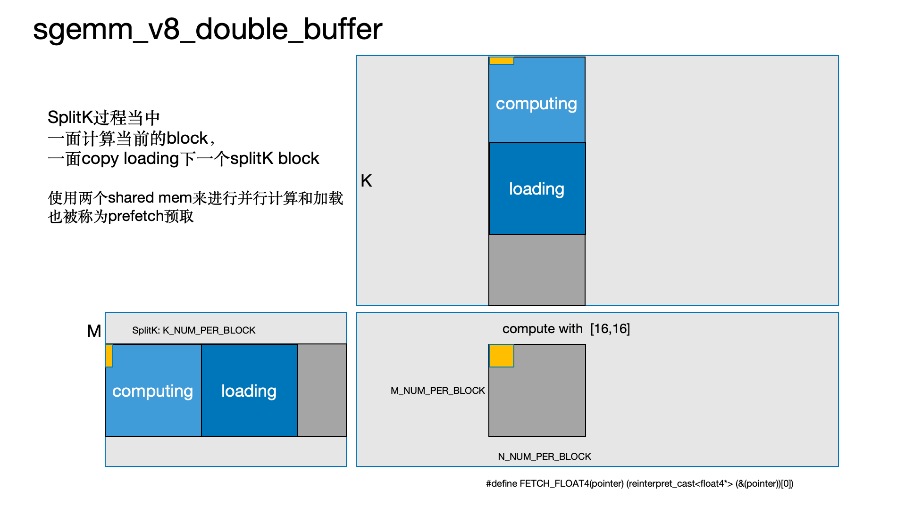
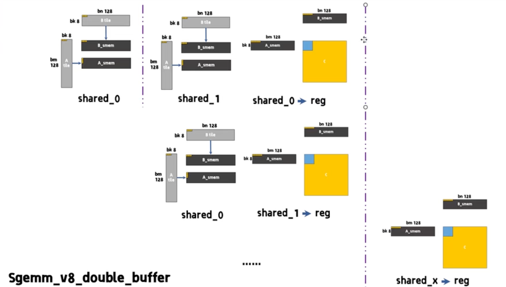

# SGEMM

#### sgemm_v0_global_mem.cu

- `block[16,16]`，每个block映射到C的block上，`thread[i,j]`处理`C[i,j]`
- block内`thread[i,j]`需要load来自于A和B的两个向量数据 read:`2K` write:`1` 


#### sgemm_v1_shared_mem.cu


#### sgemm_v2_shared_mem_sliding_window.cu


#### sgemm_v3_increase_work_of_per_thread.cu

- 把`block`负责的范围扩大，而`block`里面的`thread`数量仍然相同。原来在一个`block`当中`[1,1]`对应一个`thread`，而现在意味着在C矩阵当中的`[STRIDE,STRIDE]`个点是由block当中的一个`thread`处理的。

  - grid定义总计算的网格划分
  - block定义一个网格内，thread数量
  - 比如此处例子, `STRIDE=2` 每个thread处理C当中的`[2,2]`，线程内需要定义4个`reg` `float [2][2]`

  ```cpp
  dim3 block(BLOCK,BLOCK);
  dim3 grid((m+BLOCK-1)/BLOCK/STRIDE,(n+BLOCK-1)/BLOCK/STRIDE);//block范围两个纬度都扩张stride倍
  ```

#### sgemm_v4_float4_loading.cu



#### sgemm_v5_register_tile_outer_product.cu


#### sgemm_v6_register_tile_outer_product_float4.cu

#### sgemm_v7_register_tile_outer_product_float4_transpose.cu




#### gemm/sgemm_v8_double_buffer.cu





##### reference

- [【CUDA】Sgemm单精度矩阵乘法](https://www.bilibili.com/video/BV1DBqgY7Esf/?spm_id_from=333.1387.list.card_archive.click&vd_source=d99fb874fa9e85fe5793ec3fa65ab064)
