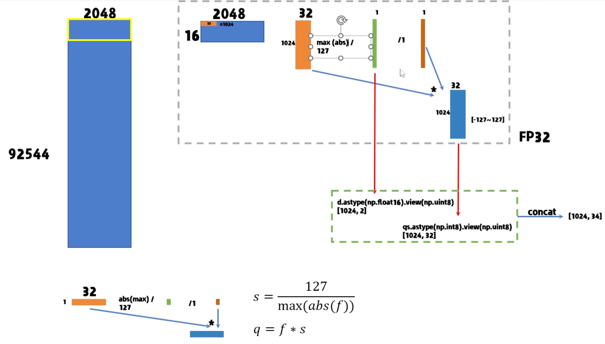
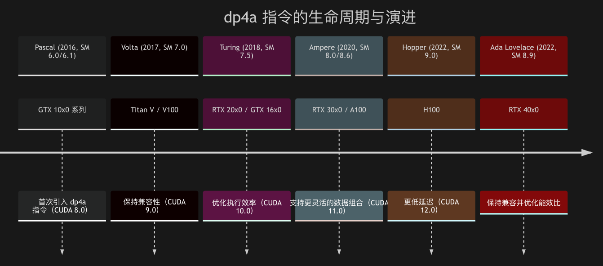

# INT8 quant CUDA

在prefill 阶段是调用 dequant，加上cublasSgemm 来实现。而在 decode 阶段是手动实现，dequant 和 GEMV 的融合。

## 权重处理

举例`[92544,2048]`做量化，按照以下数据结构来处理，默认 QK_0 是warpsize

```cpp
//weight only 
typedef struct {
    half    d;              // delta
    int8_t  qs[QK8_0];      // quants
} block_q8_0;
//tensor多保留一个 sum，在INT8 GEMV mulmat当中用到
typedef struct {
    half2   ds;             // ds.x = delta, ds.y = sum
    int8_t  qs[QK8_0];      // quants
} block_q8_1;

```

使用 python 进行量化时

```python
import numpy as np
array=np.array([])
s=127/np.max*(np.abs(array))
q_array=(array*s).astype(np.int8)
```




## weight only: dequant + GEMV -> fuse

```cpp
#define QK8_0 32
#define QR8_0 1
static void dequantize_mul_mat_vec_q8_0_cuda(const void * vx, const dfloat * y, float * dst, const int ncols, const int nrows, cudaStream_t stream) {
    GGML_ASSERT(ncols % GGML_CUDA_DMMV_X == 0);
    const int block_num_y = (nrows + GGML_CUDA_MMV_Y - 1) / GGML_CUDA_MMV_Y;
    const dim3 block_nums(1, block_num_y, 1); // (1,4096,1)
    const dim3 block_dims(WARP_SIZE, GGML_CUDA_MMV_Y, 1);  //(32,1,1)
    dequantize_mul_mat_vec<QK8_0, QR8_0, dequantize_q8_0>
        <<<block_nums, block_dims, 0, stream>>>(vx, y, dst, ncols, nrows);
}

//kernel code
static __device__ __forceinline__ void dequantize_q8_0(const void * vx, const int ib, const int iqs, dfloat2 & v){
    //因为此时的int8量化是采用的是均匀对称量化
    //根据量化公式，反量化就是int8 * scale
    const block_q8_0 * x = (const block_q8_0 *) vx;

    const dfloat d = x[ib].d; //scale

    v.x = x[ib].qs[iqs + 0]; //int8 weight 
    v.y = x[ib].qs[iqs + 1]; //int8 weight 

#ifdef GGML_CUDA_F16
    //FP16的情况
    v = __hmul2(v, {d, d});
#else
    //FP32的情况
    v.x *= d; //反量化
    v.y *= d; //反量化
#endif // GGML_CUDA_F16
}

//gridDim = {1,4096,1} , blockDim = {32,1,1}

template <int qk, int qr, dequantize_kernel_t dequantize_kernel>
static __global__ void dequantize_mul_mat_vec(const void * __restrict__ vx, const dfloat * __restrict__ y, float * __restrict__ dst, const int ncols, const int nrows) {
    // qk = quantized weights per x block
    // qr = number of quantized weights per data value in x block
  
    const int row = blockIdx.y*blockDim.y + threadIdx.y;  //0-4095

    if (row >= nrows) {
        return;
    }

    const int tid = threadIdx.x; //0-31

    const int iter_stride = 2*GGML_CUDA_DMMV_X; // 2 * 32
    const int vals_per_iter = iter_stride / WARP_SIZE; //2  num quantized vals per thread and i iter
                                                       //单个线程，for循环的一次迭代所处理的数据量--2
    const int y_offset = qr == 1 ? 1 : qk/2; // 1

// partial sum for each thread
#ifdef GGML_CUDA_F16
    half2 tmp = {0.0f, 0.0f}; // two sums for f16 to take advantage of half2 intrinsics
#else
    float tmp = 0.0f;
#endif // GGML_CUDA_F16
    //32个线程需要处理4096组数据的乘加
    
    for (int i = 0; i < ncols; i += iter_stride) {
        const int col = i + vals_per_iter*tid; //列坐标，因为一个线程一次for循环迭代处理两个数据，所以32个线程一次迭代可以处理64个数据
        const int ib = (row*ncols + col)/qk; // x block index ，就是weight数据的第几个block结构体
        const int iqs = (col%qk)/qr; // x quant index，当前列坐标所对应的weight数据block结构体内部的第几个索引
        const int iybs = col - col%qk; // y block start index，与当前weight数据block 对应的input_tensor的起始index

// processing >2 values per i iter is faster for fast GPUs
        //前面说过一个线程每次迭代都处理两个数据，向量化存取有效利用量化所节省的带宽
#pragma unroll
        for (int j = 0; j < vals_per_iter; j += 2) {
            // process 2 vals per j iter

            // dequantize
            // for qr = 2 the iqs needs to increase by 1 per j iter because 2 weights per data val
            dfloat2 v; //float2类型，就是两个float
            dequantize_kernel(vx, ib, iqs + j/qr, v); //反量化之后的数据存到v

            // matrix multiplication
            // for qr = 2 the y index needs to increase by 1 per j iter because of y_offset = qk/2
#ifdef GGML_CUDA_F16
            tmp += __hmul2(v, {
                y[iybs + iqs + j/qr + 0],
                y[iybs + iqs + j/qr + y_offset]
            });
#else
            //两个数据分别相乘后相加
            tmp += v.x * y[iybs + iqs + j/qr + 0]; 
            tmp += v.y * y[iybs + iqs + j/qr + y_offset];
#endif // GGML_CUDA_F16
        }
    }

    // sum up partial sums and write back result
    //对每个block中的tmp进行累和，即为每一行weight与input_tensor进行乘加后的结果
#pragma unroll
    for (int mask = 16; mask > 0; mask >>= 1) {
        tmp += __shfl_xor_sync(0xffffffff, tmp, mask, 32);
    }
    //当tid=0时再把每个block的结果写会结果
    if (tid == 0) {
#ifdef GGML_CUDA_F16
        dst[row] = tmp.x + tmp.y;
#else
        dst[row] = tmp;
#endif // GGML_CUDA_F16
    }
}
```

## INT8 GEMV mulmat

#### tensor 量化

```cpp
typedef struct {
    half2   ds;             // ds.x = delta, ds.y = sum
    int8_t  qs[QK8_0];      // quants
} block_q8_1;

#define QK8_1 32
static __global__ void quantize_q8_1(const float * __restrict__ x, void * __restrict__ vy, const int kx, const int kx_padded) {
    const int ix = blockDim.x*blockIdx.x + threadIdx.x; //0-4096

    if (ix >= kx_padded) {
        return;
    }
    const int iy = blockDim.y*blockIdx.y + threadIdx.y; //0
    const int i_padded = iy*kx_padded + ix; //ix
    block_q8_1 * y = (block_q8_1 *) vy; 

    const int ib = i_padded / QK8_1; // block index  因为结构体数据是以32为一组，所以ib计算得到当前数据所在结构体block的index
    const int iqs = i_padded % QK8_1; // quant index iqs计算的就是当前数据所在结构体内部的index
​
    const float xi = ix < kx ? x[iy*kx + ix] : 0.0f; //防止超出
    float amax = fabsf(xi); // 当前数据的绝对值
    float sum = xi;
   
    //一个block内部既做归约求和也做归约求最大值
#pragma unroll
    for (int mask = 16; mask > 0; mask >>= 1) {
        amax = fmaxf(amax, __shfl_xor_sync(0xffffffff, amax, mask, 32));
        sum += __shfl_xor_sync(0xffffffff, sum, mask, 32);
    }
    //套用均匀对称量化的量化公式
    //q = round(clip(r_i /scale,Q_{min},Q_{max}))
    //scale = fmax-fmin/qmax-qmin 
    const float d = amax / 127;
    const int8_t q = amax == 0.0f ? 0 : roundf(xi / d);
    //存储量化后的值
    y[ib].qs[iqs] = q;
  
    if (iqs > 0) {
        return;
    }
    //只用iqs==0的线程将scale和sum写回
    y[ib].ds.x = d;
    y[ib].ds.y = sum;
}
```

#### INT8 乘法

以例子来理解，对于`block_q8_0 X block_q8_1`, 4096实际维度是横向是128个`block_q8`

dispatch方案: GRID`[1,4096,1] ` BLOCK `[32,1,1]`

考虑单block行为，让一个warp尽可能合并访存，也就是连续`threadIdx`下访问内存也是连续的。

- 4个thread读32个数，每个thread读8个`int8`
- block内一个warp，一次处理8个block_q8，然后循环处理行剩余
- issue`warp`  inst 一次读入 A: 32/4*8B=64B 读B也是，一共128B。每个线程 launch 一个 dp4a，warp 一次算 `32*4=128`向量内积

- 变量解释

  - `vdr`（vec dot ratio，向量点积比率）
    - 定义：`vdr` 决定每个线程在一次循环中要处理多少个量化 int数据（通常是4个量化值打包成一个int）。
    - 为什么有：**不同量化格式的数据打包方式不同**，有的格式每个 int 能存4个量化值，有的能存8个。vdr 让 kernel 能灵活适配不同格式。

  - `qk` 决定每个量化块代表多少权重，`qi` 决定每个块用多少int存储量化值。

  - `iqs` 代表 **“量化块内的量化索引”**，即在一个量化块（block）内部，当前线程要处理的第几个量化值（quantized value）

- 变量举例

  - 一个 block 有 32 个量化值（qk=32），qi=8 也就是用 8 个 int 保存

  - 用 8 个 int 存储（qi=8），每个 int 存4个量化值

  - vdr=2，一个 thread 处理2个 int。`(qi/vdr) = 2`这个可以用来做 offset，每个线程读 2 个 int 也就是处理 4 个 int8

  - iqs 是用来算 offset 来给 `dp4a` 运算

    ```cpp
    mp += vec_dot_q_cuda(&x[ibx], &y[iby], iqs);
    //&x[ibx]：当前 block
    //iqs：block 内的量化起始索引
    //点积函数会用 iqs 作为偏移，取出对应的量化数据进行计算
    ```

    | threadIdx.x | iqs = vdr * (threadIdx.x % (qi/vdr)) |
    | ----------- | ------------------------------------ |
    | 0           | 2 * (0 % 4) = 0  ->[0,2)             |
    | 1           | 2 * (1 % 4) = 2                      |
    | 2           | 2 * (2 % 4) = 4                      |
    | 3           | 2 * (3 % 4) = 6                      |

```cpp
#define VDR_Q8_0_Q8_1_MMVQ 2
static void mul_mat_vec_q8_0_q8_1_cuda(const void * vx, const void * vy, float * dst, const int ncols, const int nrows, cudaStream_t stream) {
    GGML_ASSERT(ncols % QK8_0 == 0);
    const int block_num_y = (nrows + GGML_CUDA_MMV_Y - 1) / GGML_CUDA_MMV_Y;//4096
    const dim3 block_nums(1, block_num_y, 1);//[1,4096,1]
    const dim3 block_dims(WARP_SIZE, GGML_CUDA_MMV_Y, 1);//[32,1,1]
    //QK8_0 =32,quant block拥有 32 个量化值;QI8_0 = 8, 使用 8 个 int 表示;
    //VDR_Q8_0_Q8_1_MMVQ 每个 thread 读 2 个 int
    mul_mat_vec_q<QK8_0, QI8_0, block_q8_0, VDR_Q8_0_Q8_1_MMVQ, vec_dot_q8_0_q8_1>
        <<<block_nums, block_dims, 0, stream>>>(vx, vy, dst, ncols, nrows);
}

template <int vdr> static __device__ __forceinline__ float vec_dot_q8_0_q8_1_impl(
    const int * v, const int * u, const float & d8_0, const float & d8_1) {
#if __CUDA_ARCH__ >= MIN_CC_DP4A // lowest compute capability for integer intrinsics
    int sumi = 0;
#pragma unroll
    for (int i = 0; i < vdr; ++i) {
        // SIMD dot product of quantized values
        sumi = __dp4a(v[i], u[i], sumi);
    }
    return d8_0*d8_1 * sumi;
#else
    assert(false);
    return 0.0f; // only to satisfy the compiler
#endif // __CUDA_ARCH__ >= MIN_CC_DP4A
}
/**
	用来拆 offset获得 
**/
static __device__ __forceinline__ float vec_dot_q8_0_q8_1(
    const void * __restrict__ vbq, const block_q8_1 * __restrict__ bq8_1, const int & iqs) {

    const block_q8_0 * bq8_0 = (const block_q8_0 *) vbq;

    int v[VDR_Q8_0_Q8_1_MMVQ];
    int u[VDR_Q8_0_Q8_1_MMVQ];

#pragma unroll
    for (int i = 0; i < VDR_Q8_0_Q8_1_MMVQ; ++i) {
        v[i] = get_int_from_int8(bq8_0->qs, iqs + i);
        u[i] = get_int_from_int8_aligned(bq8_1->qs, iqs + i);
    }
		//注意bq8_1->ds.y 此时没有用到，可以做潜在的量化补偿
    return vec_dot_q8_0_q8_1_impl<VDR_Q8_0_Q8_1_MMVQ>(v, u, bq8_0->d, bq8_1->ds.x);
}

//gridDim = {1,4096,1} blockDim ={32,1,1}
//qk = 32 ， qi = 8 ， block_q_t=block_q8_0，vdr = 2， vec_dot_q_cuda = vec_dot_q8_0_q8_1
template <int qk, int qi, typename block_q_t, int vdr, vec_dot_q_cuda_t vec_dot_q_cuda>
static __global__ void mul_mat_vec_q(const void * __restrict__ vx, const void * __restrict__ vy, float * __restrict__ dst, const int ncols, const int nrows) {
    const int row = blockIdx.y*blockDim.y + threadIdx.y; //the index of row

    if (row >= nrows) {
        return;
    }
    const int blocks_per_row = ncols / qk; //4096 /32 = 128 一行数据共有128个block_q8_0的结构体
    const int blocks_per_warp = vdr * WARP_SIZE / qi; // 2*32/8 = 8  一个warp一次处理8个block_q8_0的结构体
                                                      // 所以，每轮迭代4个线程处理一个block_q8_0的结构体
                                                      // 所以，每轮迭代每个线程处理8个int8数据
// partial sum for each thread
    float tmp = 0.0f;
    //block_q_t = block_q8_0
    const block_q_t  * x = (const block_q_t  *) vx;  //weight 所对应的结构体指针数据
    const block_q8_1 * y = (const block_q8_1 *) vy;  //量化input_tensor的结构体指针
    //根据之前的关系，所以每个线程需要迭代128 / 8 =16次
    for (int i = 0; i < blocks_per_row; i += blocks_per_warp) {
        //weight数据 结构体指针block的索引
        //row*blocks_per_row是当前row的block index  ，i，
        const int ibx = row*blocks_per_row + i + threadIdx.x / (qi/vdr); // x block index
      
        //input_tensor数据 结构体指针block的索引，是与weight数据对齐的
        const int iby = (i + threadIdx.x / (qi/vdr)) * (qk/QK8_1); // y block index that aligns with ibx
        //iqs = [0，2，4，6]  一共 8 个 int，相当于 32 个 int8
        const int iqs  = vdr * (threadIdx.x % (qi/vdr)); // x block quant index when casting the quants to int
				//调用根据 iqs offset拆数据和 dp4a 函数
        tmp += vec_dot_q_cuda(&x[ibx], &y[iby], iqs); 
    }
    // sum up partial sums and write back result
    //对一个block内部求和
#pragma unroll
    for (int mask = 16; mask > 0; mask >>= 1) {
        tmp += __shfl_xor_sync(0xffffffff, tmp, mask, 32);
    }
    //结果写回
    if (threadIdx.x == 0) {
        dst[row] = tmp;
    }
}
```


#### dp4a

Dot Product Accumulate 4，虽然有tensor core的mma了，但是dp4a仍然是cuda core上兼容性和高效的选择。

高效性：每个线程都可做dpfa，也就是vec4int内积，那么一个warp可完成vec128int内积



**使用方式**

```cpp
//汇编使用
//u32/s32指定输入数据类型（无符号/有符号32位
//%0为输出寄存器，%1-%3为输入寄存器
asm("dp4a.u32.u32 %0, %1, %2, %3;" 
    : "=r"(result) 
    : "r"(a), "r"(b), "r"(c));

//库函数使用:参数a和b为32位输入数据（包含4个8位数据），c为累加值
#include<cuda_fp16.h>
int32_t result = __dp4a(a, b, c);   // 有符号版本

//e.g 
  __global__ void dp4a_kernel(uint32_t *d_out, uint32_t *d_a, uint32_t *d_b) {
    int idx = threadIdx.x;
    uint32_t a = d_a[idx];
    uint32_t b = d_b[idx];
    uint32_t c = 0;  // 初始累加值
    d_out[idx] = __dp4a(a, b, c);
}
```


**Reference**

- [llama.cpp源码解析--CUDA流程版本](https://zhuanlan.zhihu.com/p/665027154)

- [【大模型部署】8bit量化算子解析](https://www.bilibili.com/video/BV1NU9wY4ENo?spm_id_from=333.788.videopod.episodes&vd_source=d99fb874fa9e85fe5793ec3fa65ab064&p=4)

  此引用在最后量化矩阵乘法的dispatch逻辑上有误，其他比较好可帮助理解整体逻辑

