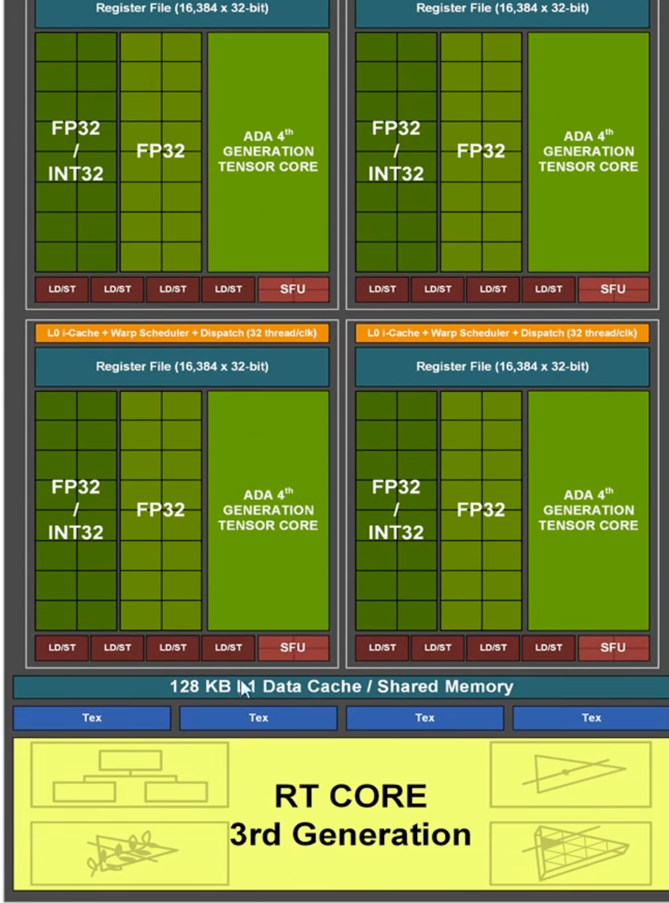
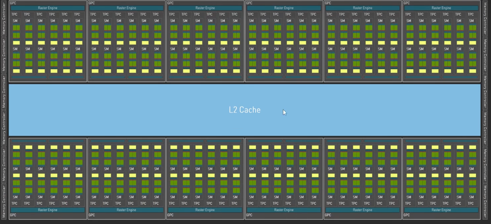

# 常见问题

- occupancy和什么有关，怎么控制?

  >  [ref](https://www.bilibili.com/video/BV1WNrHY5EeP?spm_id_from=333.788.player.switch&vd_source=d99fb874fa9e85fe5793ec3fa65ab064&p=4)

  GPU的**Occupancy（占用率）** 指每个流式多处理器（SM）上活跃的Warp数量与硬件最大支持的Warp数量的比值1。高Occupancy不一定直接提升性能，但低Occupancy会限制延迟隐藏能力，导致性能下降。

  - **Block Size（块大小）**

    单个Block的线程数需为Warp大小（32）的整数倍

  - **寄存器影响 occupancy**

    

    再比如需要 90个 reg

    

  - 共享内存

    

- bank conflict粒度?

  share mem会平均分为 32 bank，bank 4字节连续

  | **数组元素索引** | **字节地址** | **Bank编号** (32 Banks) |
  | ---------------- | ------------ | ----------------------- |
  | `s_data[0]`      | 0~3          | 0                       |
  | `s_data[1]`      | 4~7          | 1                       |
  | `...`            | ...          | ...                     |
  | `s_data[31]`     | 124~127      | 31                      |

- 访存时需要注意什么？

  合并访存和内存对齐，合并访存比如符合 尽量符合sector，尽量符合 cacheline

  - sector 32B 对齐
  - cacheline128B

- float4读写gmem为什么更快?

  原生指令支持，issue 1 inst

- block能否被调度到不同sm上

  Block（即CTA，Cooperative Thread Array）**不能**被调度到不同的SM（Streaming Multiprocessor）上执行。他们共享一个 shared mem。不同 warp 还有 sync 等操作，需要在一个 SM 内完成

  

- **讨论PyTorch中的pin memory原理** 

  把数据固定在物理内存当中，不会被操作系统分页调度 swap 到磁盘上，一般用于 dataloader 加载数据到内存而这部分数据随时加载到 GPU 显存上，于是先固定在内存当中避免触发缺页交换。

- **如果硬件是 SIMD16，但是编译器编译成 SIMD32的 vISA ，可能会造成什么？**

  编译器按照 warp 来分配资源，编译器会按照 vISA 的 SIMD32 来分配逻辑寄存器的数量。由vISA 成 ISA，对应 PTX 到 SASS 的时候会进行寄存器映射到物理寄存器等。

  Force 16 的时候，编译器会做双发射，物理寄存器需求减半。此时底层SIMD16 会采用双发射来做加同步来做，在存储受限的时候这样更好，而在计算密集的时候保持 SIMD32 更好。

  当产生 reg spill 的时候，会用到 L1 来做。

  比如每个 SM有65536 个寄存器，bank 256 个寄存器。

  

- `__restrict__` 是什么意思？

  - `__restrict__` 告诉编译器该指针是访问其所指向内存区域的唯一方式
  - 编译器可以假设没有其他指针会访问相同的内存区域

  这会让编译器在编译时

  - 减少寄存器压力
  - 提高寄存器重用率
  - 避免不必要的内存访问

  例如

  ```cpp
  __global__ void vectorAdd(float* __restrict__ a, 
                           float* __restrict__ b,
                           float* __restrict__ c) {
      int i = blockIdx.x * blockDim.x + threadIdx.x;
      c[i] = a[i] + b[i];
  }
  ```

  

- GPU上的存储, global memory, local memory, shared memory, register的大小, 带宽, 访存延迟大概是在什么级别

  - 常用卡的cache是多大

  **NVIDIA RTX 3090 (Ampere)**

  | 存储类型   | Latency & bandwidth      | size                                                | Location     |
  | ---------- | ------------------------ | --------------------------------------------------- | ------------ |
  | Register   | ~1 cycle, 80TB/s         | 255 regs/thread                                     | On-chip      |
  | Shared mem | ~20-30 cycles, 1.7TB/s   | 128KB/SM                                            | On-chip SRAM |
  | L1         | ~20-30 cycles, 1.7TB/s   | 128KB L1缓存/共享内存池（如96KB L1 + 32KB共享内存） | On-chip SRAM |
  | L2         | ~200-300 cycles, 2TB/s   | 6MB                                                 | On-chip SRAM |
  | Device mem | ~600-800 cycles, 936GB/s | 24GB GDDR6X                                         | Off-chip     |

  > | **基础频率（Base Clock）**  | **1.40 GHz（1400 MHz）**  |
  > | --------------------------- | ------------------------- |
  > | **加速频率（Boost Clock）** | **1.70 GHz（1700 MHz）**1 |
  >
  > - 80TB/s带宽理论最大带宽计算为：
    - 3090的SM数量：82个
    - 每个SM的寄存器带宽 ≈ 975GB/s
    - 总带宽 = 82 × 975GB/s ≈ 80TB/s


  	**NVIDIA RTX 4090 (Ada Lovelace)**

| 存储类型   | Latency & Bandwidth                          | Size            | Location     |
| ---------- | -------------------------------------------- | --------------- | ------------ |
| Register   | ~1 cycle, 120TB/s                            | 255 regs/thread | On-chip      |
| Shared Mem | ~15-25 cycles, 3.5TB/s  (2.5GHz下约6-10纳秒) | 128KB/SM        | On-chip SRAM |
| L1 Cache   | ~15-25 cycles, 3.5TB/s                       | 128KB/SM (独立) | On-chip SRAM |
| L2 Cache   | ~150-250 cycles, 3.5TB/s                     | 72MB            | On-chip SRAM |
| Device Mem | ~500-700 cycles, 1008GB/s                    | 24GB GDDR6X     | Off-chip     |

  > 15个时钟周期时间 = 15 × (1 / 2.5×10⁹) 秒                = 15 × 0.4×10⁻⁹ 秒                = 6×10⁻⁹ 秒                = 6 纳秒
  >
  > - 在2.5GHz频率下：
  >   - 10000个clock = 4微秒
  >   - 1毫秒 = 250,000个clock（1000微秒 ÷ 0.4纳秒）


下面以 4090 为例子，SM 内L1/Share mem 128K，由于并发线程多，所以寄存器相当多。每个 SM 128 cuda core=4 * 32。如下可以看到 16384*4=65536 个总寄存器。



  

**reference**

  - [GPU Specs 收集](https://github.com/sunkx109/GPUs-Specs) whitepaper & datasheet

  

