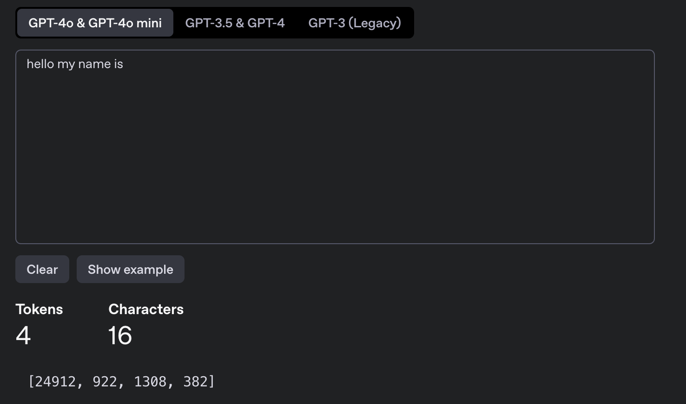

## Llama related kernels

> e.g default: internlm2-1_8b   **hidden_size**：2048  **vocab_size**：92544

#### Kernels

- concat_past_kv

- Repeat_kv
- topK

#### GGML inference

#### Shape inference

> 模型结构： https://github.com/huggingface/transformers/blob/main/src/transformers/models/llama/modeling_llama.py

 Input ids after tokenizer encode  [num_tokens]    e.g Hello my name is >>>  [24912,922,1308,382]

- embedding>>> [num_tokens, q_hidden_units]  

**Prefill**

- Prefill Attention

  - RMSNorm	>>> [num_tokens, q_hidden_units] 

  - Linear_Q_K_V  >>>[num_tokens, qkv_hidden_units] 

  - biasAddAndPaddingAndRope>>>[bs,seqlen,kv_head_num,head_size]

    经过 padding，维度统一

  ---

  - context Attention >>>[num_tokens,q_hidden_units]

    算完 attention 就把 padding 去除

  ---

  - AddResidualAnd RMSNorm>>>[num_tokens, q_hidden_units]

- FFN
  - linear_gate & linear_up >>> [2,bs,inter_size]
  - SiLU>>>[bs,inter_size]
  - Linear_down>>>[bs,q_hidden_units]
- Sample layer
  - LMhead >>> [bs, vocab_size] 
  - topK>>>[bs,K]
  - Sampling>>>[bs]

> `q_hidden_units=q_head_num * head_size`
>
> `qkv_hidden_units=(q_head +2*kv_head_num)*head_size`

##### References

1. [llama.cpp 源码解析-- CUDA版本流程与逐算子详解](https://www.bilibili.com/video/BV1Ez4y1w7fc/?spm_id_from=333.1007.0.0&vd_source=bbc0bd6d50c9a37a05c8cb4791842c0f)
2. [Llama 2 模型结构解析](https://www.bilibili.com/video/BV12h4y1N7C8/?spm_id_from=333.337.search-card.all.click&vd_source=d99fb874fa9e85fe5793ec3fa65ab064)
3. [llama 8bit](https://www.bilibili.com/video/BV1NU9wY4ENo/?spm_id_from=333.337.search-card.all.click&vd_source=d99fb874fa9e85fe5793ec3fa65ab064)
4. [llama.cpp CUDA版本的源码解析](https://www.zhihu.com/question/589100471/answer/3276334273)
5. [LLM-engineer](https://github.com/RussWong/LLM-engineering)
6. [使用CUDA解决和加速TopK问题](https://www.bilibili.com/video/BV1nF411D7Fh/?spm_id_from=333.337.search-card.all.click&vd_source=d99fb874fa9e85fe5793ec3fa65ab064)
7. [llama.cpp源码解读--cgraph计算图与sched后端调度机制详解](https://zhuanlan.zhihu.com/p/1893801096918585567) 
8. [llama.cpp源码解读--ggml框架学习](https://zhuanlan.zhihu.com/p/19968327329)
9. [GGML-Tutorial](https://github.com/Yangxiaoz/GGML-Tutorial)
10. [使用CUDA解决和加速TopK问题](https://www.bilibili.com/video/BV1nF411D7Fh/?spm_id_from=333.337.search-card.all.click&vd_source=d99fb874fa9e85fe5793ec3fa65ab064)
11. [Llama.cpp 代码浅析（一）：并行机制与KVCache](https://zhuanlan.zhihu.com/p/670515231)
12. [llama.cpp源码解读--cgraph计算图与sched后端调度机制详解](https://zhuanlan.zhihu.com/p/1893801096918585567)
13. [llama.cpp CUDA版本的源码解析](https://www.zhihu.com/question/589100471/answer/3276334273)
14. [nsight system profile](https://zhuanlan.zhihu.com/p/691307737)
