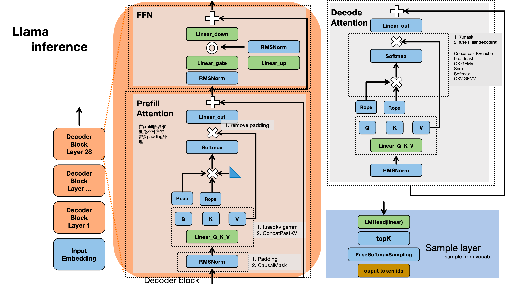

# CUDA Study

#### basic pattern

| OP        |                                         | Comment           |
| --------- | --------------------------------------- | ----------------- |
| Reduce    | Global->Shared                          |                   |
|           | Bank conflict                           |                   |
|           | warp shuffle reduce                     |                   |
|           | Unroll & remove unnecessary warp sync   |                   |
|           |                                         |                   |
| SGEMM     | Global mem ->  Shared mem               |                   |
|           | Tiling/SplitK: Block Tile               |                   |
|           | Vector loading & Layout adjustment      | e.g float4        |
|           | Loop order exchange                     |                   |
|           | Reg Tiling: Dot product-> Outer Product |                   |
|           | PingPong buffer/ double buffer          |                   |
|           |                                         |                   |
| Transpose | 访存合并                                |                   |
|           |                                         |                   |
| Attention | Fuse                                    | gemm+softmax fuse |


##### Kernels around llama inference




##### CPU Tiling verify simple example

使用numpy和循环来模拟验证GPU数据分块逻辑合理性，矩阵分块 = reshape+transpose + for indexing

```python
import numpy as np
A = np.arange(12 * 16).reshape(12, 16)
  
A_ = A.reshape(12 // 4, 4, 16 // 4, 4)
for outer_i in range(12 // 4):
    for inner_i in range(4):
        for outer_j in range(16 // 4):
            for inner_j in range(4)
            print(A_[outer_i, inner_i, outer_j, inner_j])
#tiling            
AT_ = A_.transpose(0, 2, 1, 3)
for outer_i in range(12 // 4):
    for outer_j in range(16 // 4):
         for inner_i in range(4):
            for inner_j in range(4):
            print(AT_[outer_i, outer_j, inner_i, inner_j])

#加入shared mem
a = np.zeros((4, 4), dtype=A.dtype)
for outer_i in range(12 // 4):
    for outer_j in range(16 // 4):
         a[:, :] = A_[outer_i, :, outer_j, :]
         for inner_i in range(4):
            for inner_j in range(4):
            print(a[inner_i, inner_j])          

```

##### reference

1. [使用ndarray api描述算子kernel](https://zhuanlan.zhihu.com/p/31147993255) 