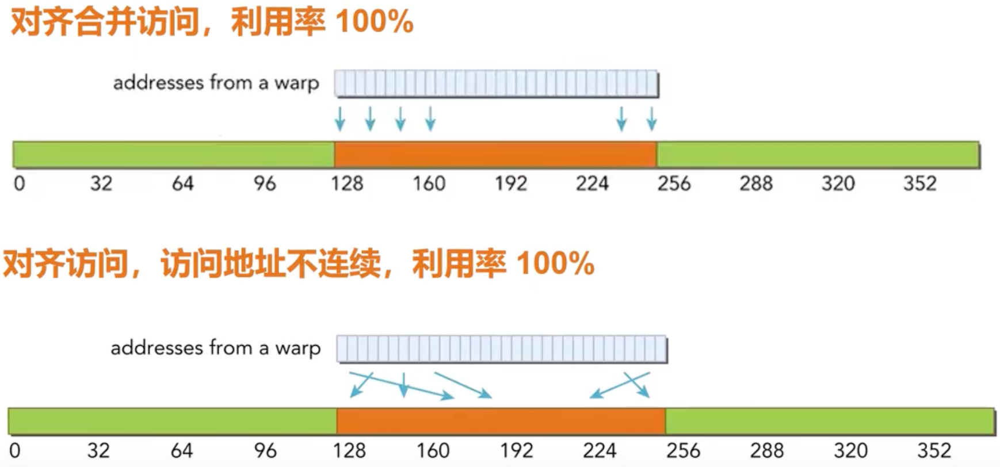
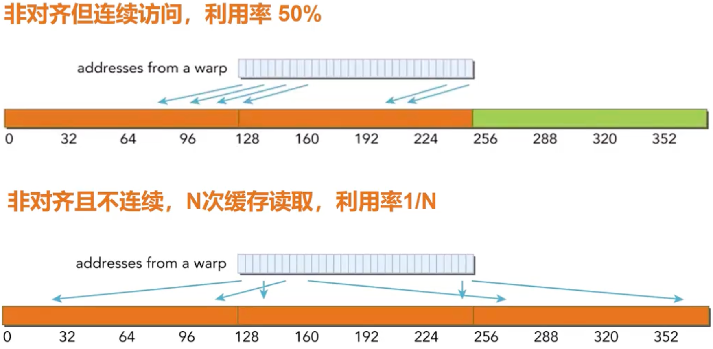
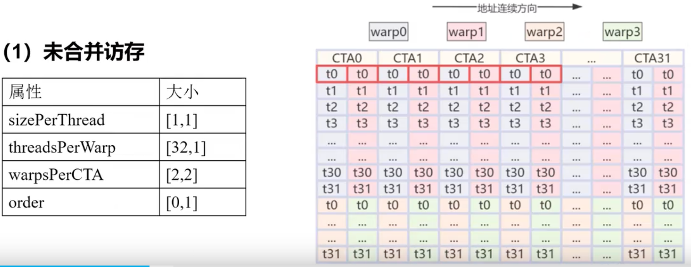
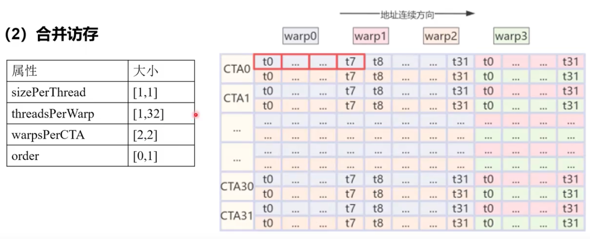

# Transpose

### Profile

对齐访问：warp需要访问的内存块首地址是cacheline大小的整数倍

合并访问：当warp中threads访问内存地址是一个连续的内存块

- 例如： warp 32 threads，each thread访问一个float 4字节，每次内存事务访问(Memory Transaction)数据是128字节

进一步根据内存地址结合Block thread分布来初步分析，此处的CTA是同一个thread block，比如第一图里面相当于[32X2,1X2]

- 第一个warp内线程在内存上为竖向分布的，由于最小取一个sector 32字节(8个float)
  - Warp每次产生32次内存事务
  - 前8个float，同一个sector被重复取了很多次 利用率低
- 第二个图符合内存连续

 

##### reference

- [cuda性能优化笔记--Transpose性能优化](https://zhuanlan.zhihu.com/p/702516288)
- [Triton访存合并解析](https://www.bilibili.com/video/BV1j6dRY8Erc/?spm_id_from=333.1007.tianma.4-3-13.click&vd_source=d99fb874fa9e85fe5793ec3fa65ab064)
- [【CUDA调优指南】合并访存与Transpose](https://www.bilibili.com/video/BV1fB6zYDEbg?spm_id_from=333.788.videopod.episodes&vd_source=d99fb874fa9e85fe5793ec3fa65ab064)