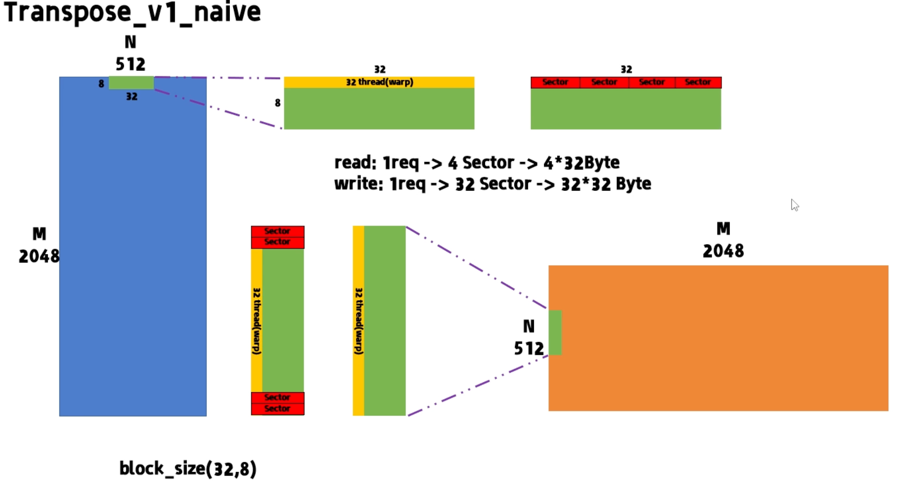
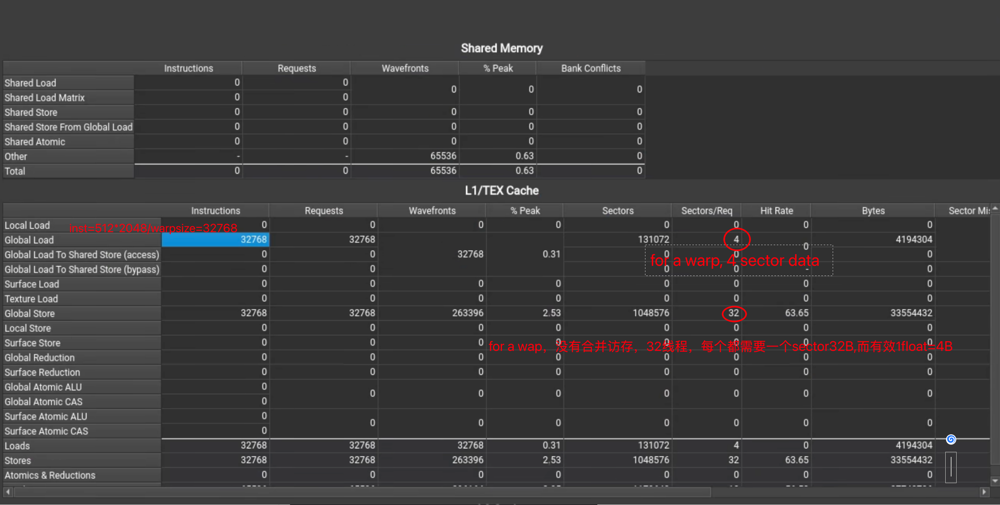
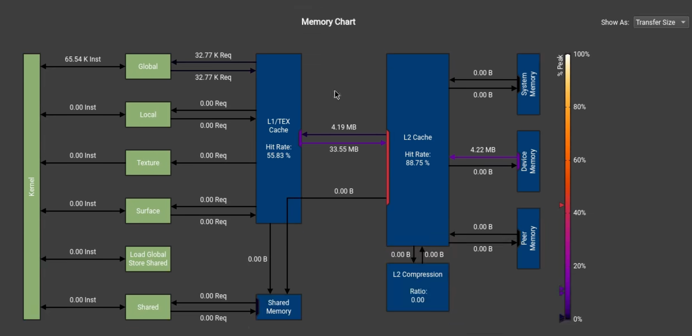
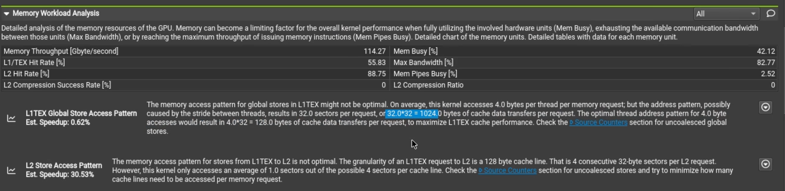
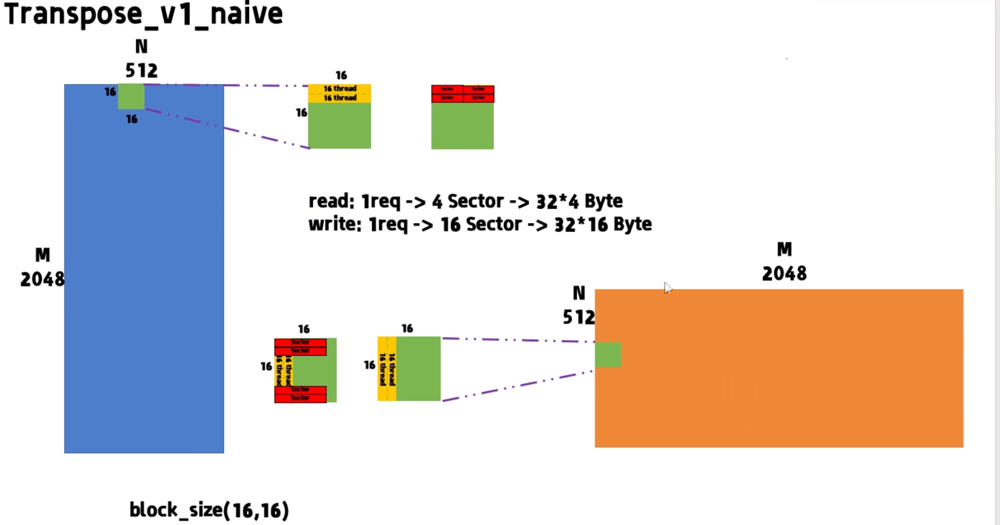
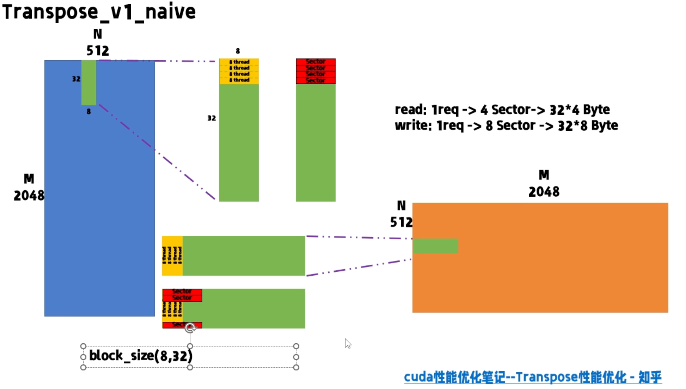
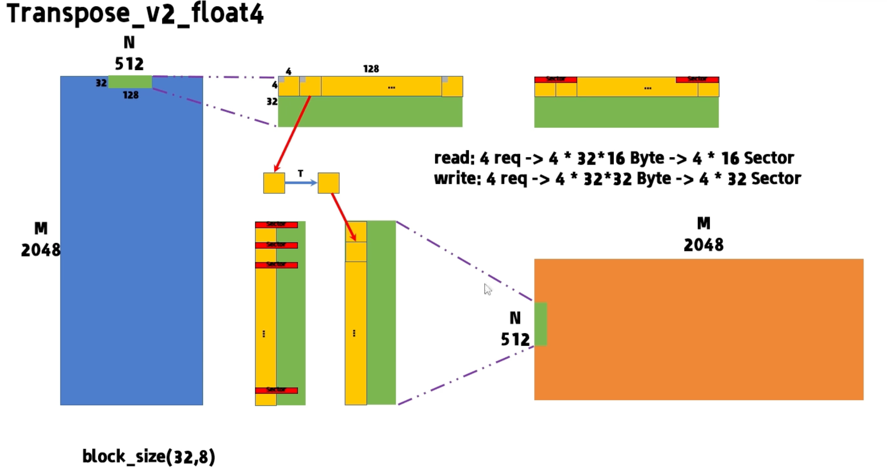

# Transpose

### case study

##### Transpose_v1_native

读的时候访存是合并的，但是写的时候**八分之七**浪费了

NCU 建议

1. 对于 L1 合并访存不够，写的部分只有四分之一有效
2. 对于 L2，命中还有空间。一个 cacheline 是 连续的4 个 sector，目前 kernel 也是一个 cacheline 当中取一个 sector 也是四分之一有效

**尝试更改 block config [32,8]->[16,16]->[8,32]** ，可以看到写需要的 sector 在变少，访存在一步步合并

- **[16,16]**

  

- **[8,32]**

  

##### Transpose_v2_float4

### 基本概念解释

对齐访问：warp需要访问的内存块首地址是cacheline大小的整数倍

**合并访问**：当warp中threads访问内存地址是一个连续的内存块

- 例如： warp 32 threads，each thread访问一个float 4字节，每次内存事务访问(Memory Transaction)数据是128字节

  sector 32B  cacheline 128B

进一步根据内存地址结合Block thread分布来初步分析，此处的CTA是同一个thread block，比如第一图里面相当于[32X2,1X2]

- 第一个warp内线程在内存上为竖向分布的，由于最小取一个sector 32字节(8个float)
  - Warp每次产生32次内存事务
  - 前8个float，同一个sector被重复取了很多次 利用率低
- 第二个图符合内存连续

 

##### reference

- [【CUDA调优指南】合并访存与Transpose](https://www.bilibili.com/video/BV1fB6zYDEbg?spm_id_from=333.788.videopod.episodes&vd_source=d99fb874fa9e85fe5793ec3fa65ab064)

- [cuda性能优化笔记--Transpose性能优化](https://zhuanlan.zhihu.com/p/702516288)

- [Triton访存合并解析](https://www.bilibili.com/video/BV1j6dRY8Erc/?spm_id_from=333.1007.tianma.4-3-13.click&vd_source=d99fb874fa9e85fe5793ec3fa65ab064)

  